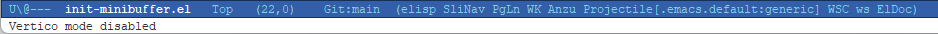
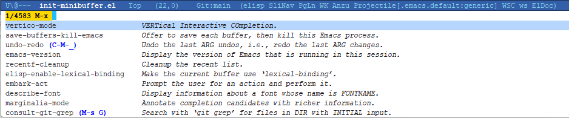
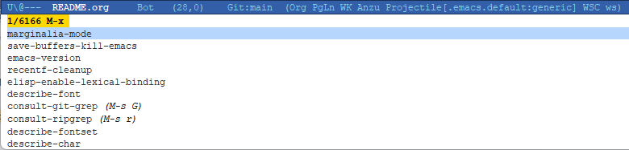
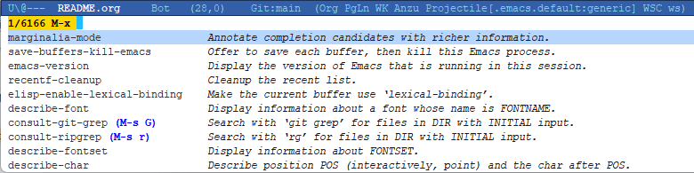

#+options: ':nil *:t -:t ::t <:t H:3 \n:nil ^:nil arch:headline
#+options: author:t broken-links:nil c:nil creator:nil
#+options: d:(not "LOGBOOK") date:t e:t email:nil expand-links:t f:t
#+options: inline:t num:t p:nil pri:nil prop:nil stat:t tags:t
#+options: tasks:t tex:t timestamp:t title:t toc:t todo:t |:t
#+title: README
#+date: <2026-04-01 周三>
#+author: ysouyno
#+email: ysouyno@163.com
#+language: en
#+select_tags: export
#+exclude_tags: noexport
#+creator: Emacs 30.2 (Org mode 9.7.11)
#+cite_export:

** 常用快捷键

1. 从 ~#+end_src~ 快速跳到 ~#+begin_src~ ： ~C-c C-v C-u~
2. ~rg-project~ 的搜索结果窗口
   + 下一个文件 ~S-M-n~
   + 上一个文件 ~S-M-p~
   + 预览当前行 ~C-o~
3. 删除两个单词间的所有空格 ~delete-horizontal-space~ ： ~M-\~
4. 拷贝 minibuffer 的所有内容： ~C-c C-l~
5. 插入换页符 ~^L~ ： ~C-q C-l~

** 包简介

*** vertico

 

*** marginalia

 

*** embark

将 minibuffer 的所有内容导出，方便复制。
